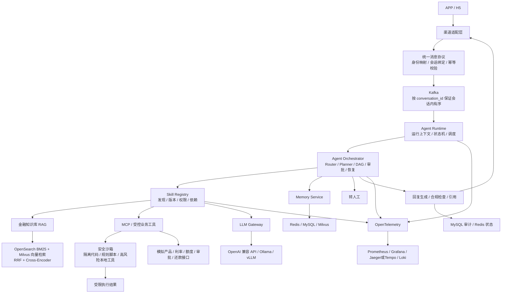

# AgentForge 金融智能客服项目上下文

## 1. 项目定位

AgentForge 是一个分阶段实施、可部署、可运营、可验证的企业级金融贷款 APP/H5 双渠道 AI 智能客服系统。系统围绕金融客服业务闭环完成规格设计、开发、测试、生产发布和持续运维。

系统面向 APP 和 H5 两类客户入口，覆盖：

- 贷前咨询与常见问题回答
- 贷款产品检索与推荐
- 金融政策及合规问答
- 利率、额度、征信和审批状态查询
- 还款计划试算
- 合同条款解读
- 无法处理或高风险问题转人工

项目计划最终部署到 Linux 服务器持续运行。首个生产版本使用虚构、合成或脱敏数据；真实征信、银行或资金方接口只有在具备合法资质、数据授权、安全评审和正式凭证后才能接入。

系统的所有质量与性能指标都必须由当前代码版本的测试、评测、压测或生产监控数据产生，不得直接沿用其他系统或历史环境的统计结果。

## 2. 不可变的五项核心技术目标

金融贷款智能客服是五项技术能力的业务载体，不会缩减此前已经确定的建设范围：

| 核心目标 | 在金融客服中的落点 | 上线前必须具备的证据 |
|---|---|---|
| Agent Runtime、Agent 编排与 Skill 体系 | 运行上下文、Agent Registry、Router、Planner、ReAct、DAG、并行/条件编排、人工审批、Checkpoint、Skill Registry 与 MCP 调度 | 确定性场景回放、编排状态机、Skill 契约/版本/权限测试、中断恢复和 Trace 记录 |
| 安全沙箱与隔离环境 | 隔离运行不可信代码、租户规则脚本、高风险本地工具和受限计算任务 | 逃逸、网络、文件、资源耗尽、超时和残留进程测试全部通过 |
| 企业级 LLM Gateway | 统一模型协议、鉴权、租户配额、路由、SSE、重试、熔断、降级、计量 | 契约、故障注入、取消传播、路由/配额和 Token 计量测试 |
| Memory 与 Knowledge Base | 分层会话记忆、摘要、结构化业务记忆、金融文档写入、混合检索、重排与引用 | 删除/过期/隔离测试、RAG 黄金集、引用正确性和备份恢复验证 |
| 高并发 Gateway 与百万级 RAG | SSE 并发控制、背压、缓存、模型吞吐、100 万向量索引与检索优化 | 目标环境压测报告、容量边界、P95/错误率、Recall@K 和资源曲线 |

### 2.1 Agent、编排、Skill 与 MCP 的关系

```text
Agent = 角色与目标 + 模型策略 + Memory + 可用 Skills + 权限与预算

Skill = Manifest + 输入/输出 Schema + 版本 + 权限 + 依赖
        + 超时/重试策略 + 实现类型 + 验收场景

Agent 编排 = Router / Planner 根据任务，把 Agent 与 Skill 按顺序、并行、
             条件、DAG、人工审批和恢复规则组合执行

MCP = Skill 调用外部工具或业务系统时可采用的一种标准协议
```

Skill 不是一段简单 Prompt，也不等同于 MCP 工具。Skill 是 Agent 可以发现和组合的标准能力单元，其实现可以是 Prompt、RAG、MCP 工具、安全沙箱任务、确定性代码或多个能力组成的复合流程。

金融客服首批 Skill 规划包括：金融知识问答、产品检索、利率查询、还款试算、合同解读、合规检查、审批状态查询和转人工。每个 Skill 都必须支持版本管理、租户权限、启用/停用、灰度发布、回滚、审计和独立测试。

这五项必须遵循同一条证据链：

```text
规格 → 最小实现 → 功能验证 → 故障/安全验证 → 性能验证 → 服务器发布 → 上线监控
```

## 3. 业务参与者

| 角色 | 主要诉求 |
|---|---|
| 贷款咨询用户 | 快速获得产品、政策、合同和还款相关答复，并能看到信息依据 |
| 人工客服 | 接收 AI 无法处理、高风险或用户主动要求转人工的会话 |
| 运营人员 | 管理知识库、产品资料、提示词、渠道和客服策略 |
| 合规/审计人员 | 检查回答依据、工具调用、敏感操作和完整审计记录 |
| 系统运维人员 | 发布、监控、告警、备份、恢复和故障处理 |
| 外部业务系统 | 通过受控接口提供产品、利率、额度、征信或审批状态等动态数据 |

## 4. 核心业务边界

### 4.1 RAG 负责的内容

适合放入知识库并要求引用来源：

- 贷款产品说明和申请条件
- 金融政策、合规制度与客服规范
- 合同模板和条款解释材料
- 常见问题、业务流程和所需材料

### 4.2 MCP/业务接口负责的内容

以下信息具有实时性或敏感性，不能让模型凭上下文生成：

- 实时利率和可申请产品
- 用户额度或征信信息
- 贷款申请和审批状态
- 个性化还款计划计算
- 需要身份校验或明确授权的业务操作

开发、测试及未获得正式授权的生产环境使用 Mock MCP 与模拟数据。接入真实接口前必须单独完成授权、鉴权、审计、超时、重试、幂等和数据脱敏设计。

### 4.3 模型禁止替代的决策

- 不把回答当成正式授信、审批或贷款承诺。
- 不允许模型自行编造利率、额度、审批结果或合同结论。
- 不在缺少来源时给出确定性的金融政策答复。
- 不允许未经确认的高风险工具调用直接产生业务副作用。

## 5. 核心业务流程



统一消息最少包含：

```text
message_id
channel
tenant_id
user_id
conversation_id
message_type
content
timestamp
trace_id
```

消息状态至少区分：

```text
received → processing → generated → sending → delivered
                                      └→ failed / manual_handoff
```

第一条最小业务闭环是：

```text
H5 用户提问
→ 统一消息接入
→ KnowledgeAgent
→ 金融知识库混合检索
→ 生成带引用的回答
→ SSE 返回
→ 保存会话、审计与 Trace
```

完成这条闭环后，再依次增加产品推荐、还款试算、动态信息查询、APP 适配和人工转接。

## 6. 要解决的核心问题

- 如何把 APP、H5 的消息、身份、连接方式和回复格式转换为统一协议。
- 如何实现可恢复、可回放、可观测的 Agent Runtime，以及支持路由、规划、顺序/并行/条件、DAG、人工审批和恢复的 Agent 编排。
- 如何建设可注册、发现、组合、版本化、授权、灰度、回滚和独立测试的 Skill 体系，并明确 Skill 与 MCP、RAG、Prompt、函数和沙箱任务的边界。
- 如何让高风险工具和不可信任务在有资源、网络、文件和生命周期限制的沙箱中运行。
- 如何建设具备统一协议、鉴权、配额、路由、熔断、降级、计量和 SSE 的企业级 LLM Gateway。
- 如何通过 `message_id` 保证幂等，并通过 `conversation_id` 分区保证同一会话有序。
- 如何让金融知识检索同时兼顾专业术语、数字条款、长合同、时效性和引用可追溯。
- 如何构建可删除、可过期、可隔离的分层 Memory，并与 Knowledge Base 明确分工。
- 如何在目标环境验证高并发 SSE、背压与容量边界，并完成 100 万向量的构建、更新、过滤、检索和效果评测。
- 如何把产品推荐、还款计算、额度/征信/审批查询拆分为权限明确、可组合、可版本化、可审计的 Agent、Skill 与 MCP 工具。
- 如何让多轮会话、转人工、失败重试和任务恢复具有明确状态。
- 如何防止提示词注入、越权查询、敏感信息泄露、错误金融承诺和无依据回答。
- 如何记录 TTFT、回答时延、检索效果、工具成功率、人工介入率、Token 成本和完整调用链。
- 如何从本地开发环境平稳发布到服务器，并具备 HTTPS、备份、监控、告警和回滚能力。

## 7. 当前非目标

第 0 步只完成业务规划，因此当前明确不做：

- 不写业务服务、前端页面或数据库表。
- 不安装依赖，不启动 Docker 容器。
- 第 0 步不实现 APP/H5 渠道代码，不接入真实征信、银行或资金方生产接口。
- 不保存真实身份证号、手机号、银行卡号、征信或贷款申请数据。
- 不把系统用于自动授信、自动审批或具有法律效力的金融决策。
- 第 0 步不实现安全沙箱，但安全沙箱仍是后续不可删除的独立建设目标。
- 不立即使用 Kubernetes，不立即部署 vLLM，不立即做 LoRA/QLoRA 微调。
- 不直接沿用其他系统或历史环境的质量与性能数据，所有基线都由当前系统重新建立。

## 8. 已确认技术栈

| 领域 | 技术选择 | 金融客服中的职责 |
|---|---|---|
| 用户端与运营端 | Next.js、TypeScript、Tailwind CSS、shadcn/ui、React Flow | H5 客服、知识运营、会话/Agent 运行详情 |
| 渠道与核心后端 | Go、Hertz、Eino | 渠道接入、统一消息、Gateway、Agent Runtime、高并发链路 |
| Agent 编排与 Skill | Go 状态机/DAG、Eino、Agent Registry、Skill Registry、JSON Schema | Agent 路由与规划、Skill 发现/组合、版本、权限、依赖、Checkpoint 和恢复 |
| RAG 与评测 | Python、FastAPI、FlagEmbedding、Cross-Encoder | 文档处理、Embedding、重排、黄金集评测 |
| 关系与状态数据 | MySQL 8.0+、Redis | 用户/租户、产品元数据、会话、运行状态、幂等、缓存与配额 |
| 异步与检索 | Kafka、Milvus、OpenSearch、MinIO | 消息和文档事件、向量、BM25、合同/制度原文 |
| 模型服务 | OpenAI 兼容 API、Ollama、vLLM | 从外部兼容 API 到本地推理逐步演进 |
| 身份与权限 | Keycloak、JWT/OAuth2、Casbin | 登录、角色、租户、知识库与工具权限 |
| 安全沙箱 | Docker Engine/API、Go Sandbox Controller；后期 Kubernetes Job、seccomp、NetworkPolicy，可选 gVisor | 隔离代码、规则脚本和高风险工具的文件、网络、进程与资源 |
| 可观测性 | OpenTelemetry、Prometheus、Grafana、Jaeger/Tempo、Loki | 消息、RAG、模型和工具调用全链路追踪 |
| 服务器发布 | Linux、Docker Compose、Nginx/Caddy、HTTPS、CI/CD | 反向代理、证书、部署、健康检查与回滚 |
| SDD | Markdown、OpenAPI、JSON Schema、AsyncAPI、Gherkin、ADR、Mermaid | 业务规则、接口、事件、场景和决策 |
| Harness | Fake LLM、Mock MCP、Testcontainers、RAG 评测、k6、安全测试 | 正确性、稳定性、效果、安全和性能门禁 |

## 9. 数据、安全与合规约束

- 所有业务表显式包含 `tenant_id`、`created_at`、`updated_at` 和 `version`。
- 所有 Repository 查询必须带 `tenant_id`，并用跨租户恶意测试验证隔离。
- 日志和 Trace 禁止记录完整身份证号、手机号、银行卡号、Token 或原始征信内容。
- 知识回答必须保存文档版本、chunk、检索分数和引用，方便审计与纠错。
- 工具调用必须记录调用人、租户、用途、输入摘要、授权结果、响应状态和 trace_id。
- Agent 与 Skill 定义必须记录版本、租户可见性、权限、依赖、发布状态和审计信息；禁用或回滚后不能继续调度旧版本。
- 涉及用户隐私或高风险操作时，必须鉴权、确认、最小授权，并能转人工。
- 不可信或高风险执行必须进入沙箱；沙箱默认禁网、非 root、只读根文件系统、限制 CPU/内存/PID/时长，并在任务结束后销毁。
- 生产用户端默认显示“信息仅供参考，以金融机构正式结果为准”，且不能暴露管理端和基础组件端口。

## 10. 服务器上线目标

上线不是“Docker 容器能够启动”，而是同时满足：

1. 使用域名和 HTTPS 对外提供 H5/API 服务，只开放必要端口。
2. 配置开发、测试、生产环境隔离，密钥不进入 Git。
3. 数据库迁移可追踪，MySQL、MinIO 等关键数据可备份并完成恢复演练。
4. 服务具备健康检查、资源限制、自动重启、日志轮转和磁盘容量保护。
5. 核心链路有监控和告警，可通过 trace_id 定位故障。
6. 发布前自动执行规格、测试、RAG 基线和安全检查。
7. 新版本可以灰度或滚动发布，异常时能够回滚。
8. 对外版本只使用合法授权的模型、知识和业务数据。
9. 五项不可变核心技术目标全部通过目标环境发布门禁，并留存可复现报告。

第一版计划在单台 Linux 服务器使用 Docker Compose 部署；当出现多实例、高可用或弹性扩缩容的真实需求后，再通过 ADR 评估 Kubernetes。

### 10.1 五项核心能力的发布硬门禁

| 核心能力 | 正式发布的最低门禁 |
|---|---|
| Agent Runtime / 编排 / Skill | 核心金融场景可确定性编排与回放；Agent/Skill 注册、发现、版本、权限、顺序/并行/条件/DAG、人工审批、预算、失败重试、Checkpoint 和中断恢复测试通过 |
| 安全沙箱 | non-root、只读根目录、默认禁网、资源/PID/时长限制和任务销毁生效；严重逃逸与越权测试 0 失败 |
| LLM Gateway | OpenAI 兼容契约、鉴权、配额、路由、SSE 取消、有限重试、熔断/降级、Token 与费用计量测试通过 |
| Memory / Knowledge Base | 多租户隔离、记忆删除/过期、文档版本、混合检索、引用和备份恢复测试通过，RAG 指标达到既定基线 |
| 高并发 / 百万级 RAG | 完成 10/50/100/500/1000 并发阶梯压测和 100 万向量实验；目标并发级别、P95、错误率、Recall@K 与资源上限达到 NFR |

第 1 步必须结合最终服务器配置，在非功能需求中确定“正式上线采用哪个并发级别”及其 P95、错误率和资源阈值。测试阶梯与 100 万向量验证不能删除；如果目标硬件达不到，必须先扩容、调整拓扑或优化，不能跳过门禁直接宣布完成。

服务器部署后还要在生产拓扑重新执行冒烟、隔离、恢复和选定级别的性能验证，确认结果与发布前报告一致。

## 11. SDD + Harness 的含义

SDD 负责定义“正确是什么”：金融业务规则、目标与非目标、契约、状态机、安全不变量、错误处理、SLO 和验收场景。

Harness 负责验证“实现是否真的正确”：固定金融文档与问题集、Fake LLM、Mock MCP、Skill 契约与组合场景、Agent 编排回放、渠道消息场景、RAG 评测、越权测试、压测、Trace 和发布检查。

```text
业务规格 → 实现 → 自动验证 → 结果说明 → 用户确认已看懂 → 下一步
```

这条链路贯穿本地开发、测试环境和服务器发布，不在项目结束后补做。
