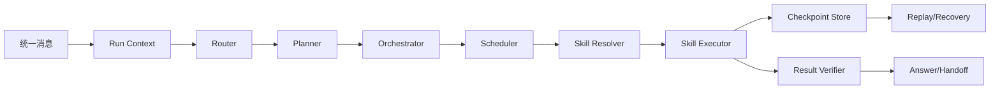
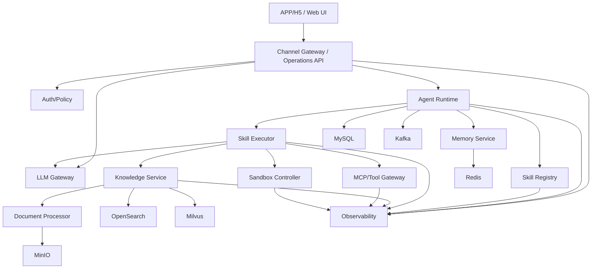

# AgentForge 容器视图与职责边界

状态：第 2 步架构规格基线，待确认  
版本：0.1.0  
更新日期：2026-07-26

## 1. 容器总览

| 容器 | 技术方向 | 主要职责 | 不负责的内容 |
|---|---|---|---|
| APP/H5 Channel Gateway | Go/Hertz | 身份映射、统一消息、SSE/WebSocket、幂等、回传 | Agent 规划、模型路由 |
| Web/Operations API | Go/Next.js BFF | 运营、客服、审计和配置 API | 直接访问基础设施 |
| LLM Gateway | Go/Hertz | OpenAI 兼容协议、Provider、鉴权、配额、路由、SSE、Fallback、计量 | 业务 Agent 规划 |
| Agent Runtime | Go/Eino + 自研 | Run、Task、Router、Planner、Orchestrator、Scheduler、Checkpoint、回放 | 直接绕过 Skill 调工具 |
| Skill Registry | Go/MySQL/JSON Schema | Skill Manifest、版本、依赖、权限、可见性、发布和回滚 | 执行未注册能力 |
| Memory Service | Go/Redis/MySQL/Milvus | 短期会话、摘要、结构化记忆、语义记忆、删除和过期 | 保存所有原始文档 |
| Knowledge Service | Python/FastAPI | 文档解析编排、OCR、切片、Embedding、BM25/向量检索、重排、引用 | 实时额度和审批查询 |
| Document Processor | Python/沙箱 | 文件检查、OCR、版面分析、表格提取、结构化结果 | 直接对外提供业务 API |
| MCP/Tool Gateway | Go/Eino/MCP | 工具注册、Schema、授权、超时、重试、幂等和审计 | 无权限的任意外部访问 |
| Sandbox Controller | Go/Docker API | 创建、限制、监控和销毁隔离任务 | 直接执行不受限代码 |
| Auth/Policy | Keycloak/Casbin | OIDC、JWT、RBAC、租户和资源策略 | 业务数据查询 |
| Observability | OTel/Collector/Prometheus/Grafana/Jaeger/Loki | 日志、指标、Trace、告警和审计导出 | 修改业务状态 |
| Web UI | Next.js/TypeScript | H5 对话、运营、客服、审计和运行详情 | 直接调用模型或数据库 |

## 2. Agent Runtime 内部组件



### 2.1 Run Context

包含运行级元数据：

```text
run_id
tenant_id
user_id
conversation_id
channel
trace_id
deadline
step_budget
token_budget
cost_budget
model_policy
memory_policy
skill_policy
```

### 2.2 Router

根据用户意图、租户策略、上下文长度、敏感级别和可用 Agent 选择目标 Agent。Router 不能直接执行工具。

### 2.3 Planner

把用户目标转换为受约束的任务计划。Planner 输出必须通过：

- Schema 校验
- 依赖检查
- 权限检查
- 最大步数检查
- 循环检查
- 预算检查

### 2.4 Orchestrator/Scheduler

Orchestrator 负责解释计划，Scheduler 负责调度 Ready 节点。支持：

- 顺序节点
- 可控并行节点
- 条件分支
- 人工审批节点
- 重试、超时和取消
- Checkpoint 和恢复
- 幂等和补偿

### 2.5 Skill Resolver/Executor

Resolver 只返回已发布、租户可见、权限允许、依赖满足且版本兼容的 Skill。Executor 根据 Skill 实现类型调用 RAG、MCP、LLM、确定性代码或沙箱。

## 3. Skill Registry 边界

Skill Registry 管理：

- Manifest 和 JSON Schema
- Skill 版本和依赖
- 租户可见性和权限
- 输入副作用等级
- 超时、重试和并发策略
- 发布、灰度、停用和回滚
- 契约测试和评测报告

Skill Registry 不执行 Skill，也不持有外部系统长期凭证。执行凭证由受控的 MCP/Secret 管理层提供。

## 4. 数据容器

| 数据组件 | 保存内容 | 关键约束 |
|---|---|---|
| MySQL | 租户、用户、Agent、Skill、Run/Task、文档元数据、审计 | 所有业务查询带 tenant_id |
| Redis | 会话短期状态、幂等键、配额、限流、热点缓存 | Key 必须包含租户或资源边界 |
| Kafka | 消息、文档解析、Embedding、Agent 事件、审计事件 | 至少一次投递，消费者幂等 |
| MinIO | 原文件、缩略图、OCR/版面中间结果、报告 | 私有 Bucket、签名 URL、租户前缀 |
| OpenSearch | BM25 索引 | 强制 tenant_id 和文档版本过滤 |
| Milvus | 文本/表格/图片向量 | Collection/字段过滤不能绕过租户 |

## 5. 调用边界

- Web UI 只访问 Channel Gateway 或 Operations API。
- Channel Gateway 不直接查询 Milvus、OpenSearch 或模型。
- Agent Runtime 不直接访问外部金融系统，必须通过 Skill/MCP。
- Skill 不得绕过权限、配额、LLM Gateway 和沙箱。
- Document Processor 不直接访问公网，原始文件只通过内部对象引用读取。
- Observability 只接收脱敏事件，不能成为业务数据旁路。

## 6. 容器视图


