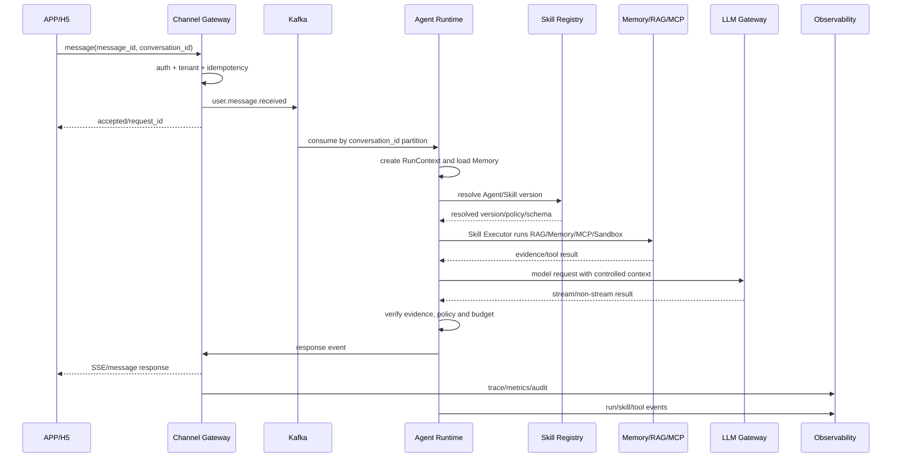
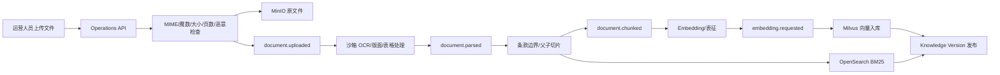

# AgentForge 数据流与事件流

状态：第 2 步架构规格基线，待确认  
版本：0.1.0  
更新日期：2026-07-26

## 1. 数据流分类

| 数据流 | 特征 | 处理方式 |
|---|---|---|
| APP/H5 用户消息 | 需要快速反馈、同会话有序 | 同步接入 + Kafka 异步执行 + SSE/消息回传 |
| 金融文档处理 | CPU/GPU 密集、可重试 | 对象存储 + Kafka 异步任务 |
| Agent Run | 状态多、需要恢复 | MySQL 状态 + Kafka 事件 + Redis 热状态 |
| RAG 查询 | 低延迟、多租户过滤 | OpenSearch + Milvus + 重排 |
| 动态业务查询 | 外部依赖、敏感、需授权 | MCP 同步调用 + 超时/重试/审计 |
| 沙箱任务 | 高风险、资源受限 | Sandbox Controller 异步或受控同步 |
| 观测与审计 | 全链路旁路数据 | OTel 事件 + 脱敏存储 |

## 2. APP/H5 消息流



### 2.1 接入要求

- 客户端提供的 `tenant_id` 只能作为提示字段，真实租户来自已验证身份和服务端策略。
- `message_id` 是幂等键，重复消费必须返回已有结果或安全状态。
- `conversation_id` 作为 Kafka 分区键，同一会话有序，不同会话可以并行。
- 接入成功只代表消息已持久化，不代表模型已经生成或用户已经收到。

## 3. 多模态文档流



每个阶段都必须携带 `tenant_id`、`document_id`、`document_version`、`job_id`、`attempt`、`trace_id` 和 `source_object_key`。

重复事件不能重复产生向量、索引或版本状态。

## 4. 动态业务数据流

```text
用户请求
→ Agent/Skill 权限检查
→ MCP Tool Gateway
→ 外部业务系统
→ Schema 校验
→ 敏感字段过滤
→ 结果写入审计
→ 受控上下文
→ LLM Gateway
```

外部系统失败时：

- 可重试的网络/限流错误按工具策略重试。
- 参数错误、权限错误和数据冲突不得自动重试。
- 多次失败转人工或返回明确无法查询。
- 不允许模型使用旧 Memory 或猜测值替代实时结果。

## 5. Agent Run 与恢复流

```text
Run Created
→ Plan Created
→ Task Ready
→ Skill Resolved
→ Task Running
→ Checkpoint Saved
→ Task Succeeded/Retrying/Failed
→ Run Completed/Handoff/Cancelled
```

每个可产生副作用的节点在执行前保存幂等键和 Checkpoint。服务重启后由恢复器扫描：

- `RUNNING` 且租约过期的任务
- `RETRYING` 且到达重试时间的任务
- `WAITING_APPROVAL` 且仍然有效的审批
- `PENDING/READY` 且依赖满足的任务

恢复器不能重复产生已成功的业务副作用。

## 6. 事件主题规划

| Topic | 生产者 | 消费者 | 分区键 |
|---|---|---|---|
| `user.message.received` | Channel Gateway | Agent Runtime | conversation_id |
| `agent.run.events` | Agent Runtime | Replay/Observability | run_id |
| `skill.execution.events` | Skill Executor | Runtime/Observability | run_id |
| `document.uploaded` | Operations API | Document Processor | document_id |
| `document.parsed` | Document Processor | Chunker | document_id |
| `document.chunked` | Chunker | Embedding/BM25 | document_id |
| `embedding.requested` | Embedding Worker | Milvus Writer | document_id |
| `audit.events` | All services | Audit Sink | tenant_id |
| `evaluation.requested` | Evaluation API | Eval Worker | evaluation_id |
| `dead-letter.*` | Failed consumers | Operations | original key |

具体字段、版本和兼容规则在第 3 步使用 AsyncAPI/JSON Schema 定义。

## 7. 投递、重试与死信

- Kafka 消费采用至少一次投递。
- 消费者必须使用幂等键和状态检查。
- 临时错误使用指数退避和最大重试次数。
- 参数、权限和 Schema 错误直接失败，不进行无意义重试。
- 超过重试次数进入租户隔离的死信队列。
- 死信记录原事件摘要、失败原因、重试次数、trace_id 和处理人。
- 手工重放前必须重新执行权限、版本和幂等检查。

## 8. 可观测数据流

所有服务使用统一 `trace_id`，关键 Span 至少包括：

```text
channel.receive
message.idempotency
agent.route
agent.plan
skill.resolve
skill.execute
memory.load
rag.retrieve
rag.rerank
mcp.call
sandbox.run
llm.request
response.verify
channel.deliver
```

日志只保存脱敏摘要；原始文件和高敏工具结果使用受控对象引用，不直接写入普通日志。
