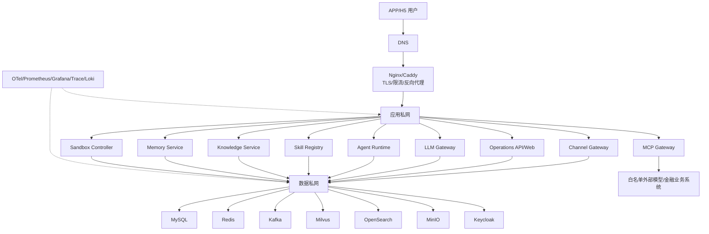

# AgentForge 部署视图与环境拓扑

状态：第 2 步架构规格基线，待确认  
版本：0.1.0  
更新日期：2026-07-26

## 1. 部署原则

- 本地、测试、性能和生产环境配置分离。
- 生产对外只暴露必要的 HTTPS 入口。
- MySQL、Redis、Kafka、Milvus、OpenSearch、MinIO、Keycloak 和监控组件不直接暴露公网。
- Docker Compose 是第一版部署方式；高可用和弹性需求达到阈值后再用 ADR 评估 Kubernetes。
- 部署拓扑必须能够支撑 1000 SSE 连接、100 活跃生成和 100 万向量目标，不能用单机资源不足作为删除目标的理由。
- 所有生产变更通过 CI/CD、健康检查、灰度/滚动和回滚。

## 2. 环境分层

| 环境 | 用途 | 数据 | 外网依赖 | 质量门禁 |
|---|---|---|---|---|
| Local | 开发和单元/集成测试 | 合成数据 | Fake LLM/Mock MCP | 格式、单测、契约 |
| Test | 集成、端到端和安全测试 | 固定脱敏数据 | 可控测试依赖 | 集成、回放、隔离、沙箱 |
| Performance | 并发和百万向量测试 | 可复现大数据集 | 固定基准模型 | k6、RAG、容量、资源 |
| Production | 正式运行 | 合法授权数据 | 受控外部系统 | 全部 GA 门禁和上线复验 |

环境之间不得共享生产密钥、租户数据或对象存储 Bucket。

## 3. 第一版生产拓扑



“第一版生产拓扑”描述逻辑边界，不预设所有组件必须在一台主机。性能环境可以将数据、应用、模型和沙箱拆分到多个节点。

## 4. 网络与端口原则

公网只允许：

```text
443/TCP HTTPS
必要时 80/TCP 用于证书跳转或校验
```

内部端口通过私网或 Docker 网络访问：

- MySQL：应用私网
- Redis：应用私网
- Kafka：数据私网
- Milvus/OpenSearch：知识服务和数据私网
- MinIO：内部对象 API，管理端不公网暴露
- Keycloak：仅认证入口或内部访问
- Prometheus/Grafana/Trace：VPN、堡垒机或内部管理网络

所有出站访问使用白名单、DNS/域名策略和审计，默认拒绝任意公网访问。

## 5. 服务部署与伸缩

### 5.1 无状态服务

以下服务优先设计为无状态，可多实例运行：

- Channel Gateway
- Operations API
- LLM Gateway
- Agent Runtime Worker
- Knowledge API
- Memory API
- MCP Gateway
- Sandbox Controller

会话状态、幂等、配额和 Checkpoint 不能只保存在进程内存中。

### 5.2 有状态服务

- MySQL：业务和审计元数据
- Redis：短期状态、限流、缓存和幂等
- Kafka：事件和消费位点
- Milvus：向量索引
- OpenSearch：BM25 索引
- MinIO：原文件和解析结果

有状态服务必须有容量、备份、恢复、版本和升级策略。

### 5.3 容量 profile

| Profile | 适用阶段 | 要求 |
|---|---|---|
| Dev | 本地 | 单实例、Fake/Mock、小数据 |
| Test | 集成 | 固定组件、故障注入、隔离测试 |
| Perf | 性能 | 1000 SSE、100 活跃生成、100 万向量、独立监控 |
| Prod-Single | 初始生产 | Compose、备份、监控、回滚、容量受控 |
| Prod-Scale | 扩容后 | 多实例、数据服务拆分或 Kubernetes，经 ADR 批准 |

## 6. 发布流程

```text
代码/规格变更
→ 静态检查与单元测试
→ 契约/集成/安全测试
→ RAG/Agent/Skill 评测
→ 构建不可变镜像
→ 测试环境部署
→ 冒烟和回归
→ 性能/容量门禁
→ 生产审批
→ 灰度/滚动发布
→ 健康检查和指标观察
→ 完成或回滚
```

发布必须记录：

```text
git_commit, image_digest, schema_version, agent_version,
skill_versions, model_policy_version, knowledge_version,
config_version, operator, approval, result
```

## 7. 备份、恢复和灾备

- MySQL 使用可验证的全量/增量备份策略。
- MinIO 原文件、OCR/版面结果和评测报告必须备份。
- Milvus/OpenSearch 索引可以重建，但必须保留元数据、版本和重建脚本。
- Redis 短期状态可按策略恢复或失效，不能把 Redis 当作唯一事实来源。
- Kafka 消费位点和死信事件按审计需要保留。
- 关键配置、Skill/Agent 版本和部署清单进入版本库，不包含密钥。
- 每季度至少执行一次恢复演练。
- GA 目标为 RPO ≤ 1 小时、RTO ≤ 2 小时。

## 8. 生产发布前复验

在目标生产拓扑必须重新执行：

- APP/H5 健康和核心业务冒烟
- 租户隔离和权限测试
- Agent/Skill 注册、版本、编排和恢复测试
- 文件安全、OCR、表格和引用测试
- 沙箱攻击和资源限制测试
- LLM Gateway 取消、重试、Fallback 和配额测试
- 1000 SSE/100 活跃生成选定负载测试
- 100 万向量检索和资源测试
- 备份恢复和版本回滚测试

任何一个硬门禁失败，生产状态为“发布失败/待优化”。
