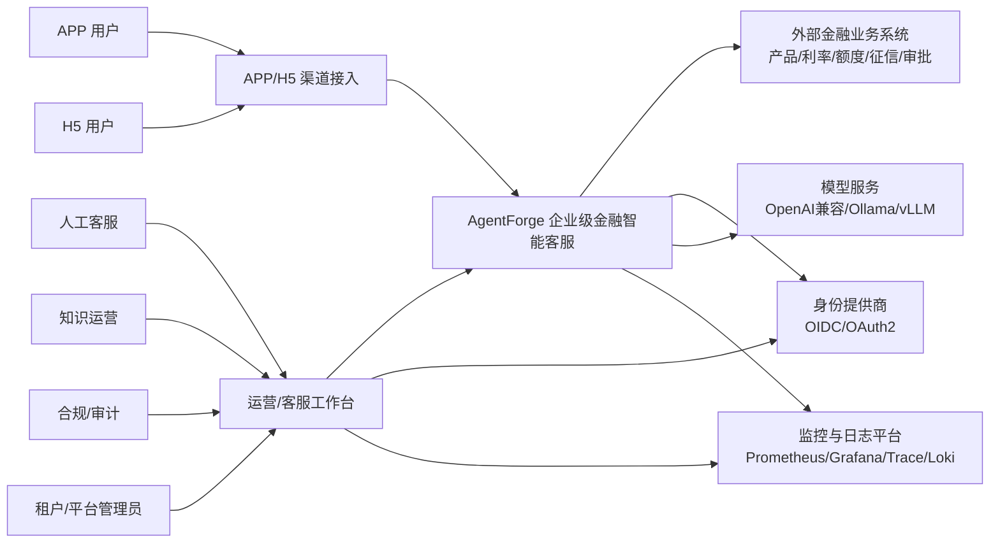

# AgentForge 系统上下文

状态：第 2 步架构规格基线，已确认
版本：0.1.0  
更新日期：2026-07-26

## 1. 系统目标

AgentForge 为金融贷款机构提供 APP/H5 双渠道 AI 智能客服，完成金融知识问答、产品咨询、合同解读、还款试算、动态业务查询和转人工，同时提供企业级 Agent 编排、Skill 管理、安全沙箱、Memory、知识库、模型网关、可观测性和生产运维能力。

## 2. 系统边界

### 2.1 系统内

- APP/H5 渠道接入和统一消息协议
- 用户、租户、会话、权限和配额
- Agent Runtime、Agent 编排和 Skill Registry
- Memory 与多模态 Knowledge Base
- LLM Gateway 和模型路由
- MCP 工具注册、授权、调用和审计
- 安全沙箱和隔离执行
- 运行状态、Checkpoint、Trace、指标和审计
- 运营端、合规端和运维管理能力

### 2.2 系统外

- APP 客户端本身及其发布渠道
- 外部身份提供商或企业 SSO
- 真实征信、银行、资金方和审批业务系统
- 外部模型供应商、Ollama 或 vLLM 实例
- 域名、DNS、证书和服务器基础设施
- 人工客服的现有工单或客服系统

系统外部依赖必须通过明确契约、鉴权、超时、重试、幂等和审计接入。没有合法授权时使用 Mock MCP 和合成数据。

## 3. 外部参与者

| 参与者 | 交互内容 | 信任级别 |
|---|---|---|
| APP 用户 | 登录、文本/图片提问、查看回答、引用和转人工 | 不可信输入 |
| H5 用户 | 登录、文本/图片提问、SSE 流式回答 | 不可信输入 |
| 人工客服 | 接管会话、查看摘要、人工回复、关闭会话 | 受控人员 |
| 知识运营人员 | 上传、审核、发布和回滚文档/产品资料 | 高权限后台 |
| Agent/Skill 运营人员 | 配置 Agent、Skill、模型策略和编排版本 | 高权限后台 |
| 合规/审计人员 | 查询回答依据、工具调用、权限和审计事件 | 只读高敏后台 |
| 租户管理员 | 管理本租户用户、角色、配额和资源 | 租户范围 |
| 平台运维人员 | 发布、监控、备份、恢复和容量管理 | 平台范围 |
| 外部业务系统 | 提供授权的产品、利率、额度、征信、审批等动态数据 | 外部受控系统 |
| 模型服务 | 接收模型请求并返回文本/图片理解或流式结果 | 外部受控依赖 |

## 4. 系统上下文图



## 5. 核心业务上下文

### 5.1 客户咨询

```text
APP/H5
→ 统一身份和会话
→ Agent Router
→ Agent Orchestrator
→ Skill
→ RAG / MCP / LLM Gateway / Memory
→ 合规检查与引用
→ APP/H5 或人工客服
```

### 5.2 多模态文档

```text
知识运营上传 PDF/扫描件/图片
→ 文件安全检查
→ 沙箱 OCR/版面/表格解析
→ 文档版本和片段元数据
→ Embedding + BM25 + 向量索引
→ Knowledge Base 发布
```

### 5.3 动态业务数据

```text
用户问题
→ Agent/Skill 权限检查
→ MCP 工具
→ 外部金融系统
→ 工具结果校验与审计
→ 受控回答
```

模型不能替代外部金融系统产生实时利率、额度、征信或审批结果。

## 6. 信任边界

```text
边界 A：APP/H5 用户输入 → 渠道接入层
边界 B：应用服务 → 外部模型/金融业务系统
边界 C：应用服务 → 文件/OCR/沙箱执行环境
边界 D：租户 A → 租户 B 的数据、Memory、Skill、日志和索引
边界 E：运营人员 → 生产发布和高风险工具
```

每次跨越信任边界都必须执行身份、租户、权限、输入、输出、审计和超时检查。

## 7. 架构不变量

- 所有业务请求都有 `tenant_id`、`user_id`、`conversation_id`、`trace_id`。
- 所有 Agent/Skill/Tool 调用都能关联到一次 Agent Run。
- 动态金融数据必须来自受控 MCP/业务接口。
- 文件解析和不可信执行必须进入安全沙箱。
- MySQL 保存业务元数据，Milvus 保存向量，OpenSearch 负责 BM25，MinIO 保存原始对象。
- APP/H5 不直接访问内部服务和基础设施。
- 任一租户不能读取、修改或通过缓存/检索/日志间接获取其他租户数据。
- 第 3 步才定义外部接口字段和事件 Schema，本步只固定职责和边界。

## 8. 架构验收问题

完成本步后必须能够回答：

1. APP/H5 为什么不能直接调用多个内部服务？
2. 为什么实时利率不能只依赖 RAG 或模型？
3. 为什么 OCR 和文件解析需要沙箱？
4. Agent、Skill、MCP、Memory 和 Knowledge Base 的边界是什么？
5. 哪些服务需要同步响应，哪些任务必须异步化？
6. 1000 SSE、100 活跃生成和 100 万向量目标由哪些组件共同支撑？
