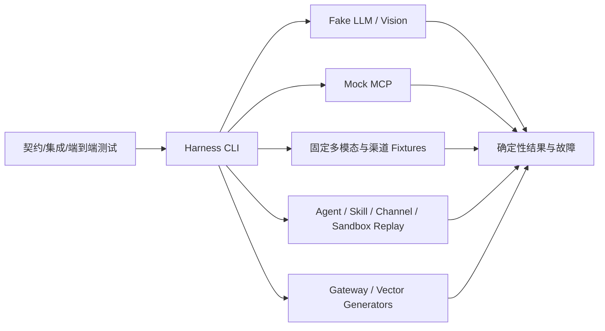

# 第 6 步：金融客服 Harness 规格

状态：第 6 步实现基线  
版本：0.1.0  
更新日期：2026-07-28

## 1. 目标

本步建立不依赖真实模型、付费 API、真实资金方接口和随机输出的确定性验证环境，为后续 Knowledge Base、LLM Gateway、渠道、Agent、Skill、Memory 与 Sandbox 实现提供稳定的正常、故障、安全和规模输入。

本步完成后应满足：

- Fake LLM 能以 OpenAI 兼容格式返回固定文本、受控图片回答、JSON、Tool Call 和 SSE。
- Fake LLM 能稳定触发延迟、429、500、503、超时、流中断和无效 JSON。
- Mock MCP 能按现有 ToolInvocation/ToolResult 契约返回虚构的产品、利率、还款和审批状态，并稳定触发失败、超时、拒绝和待审批。
- 固定文本 PDF、扫描 PDF、PNG、JPEG、表格和 APP/H5 消息具有稳定哈希和人工整理的 OCR、版面、表格及引用基准。
- Agent/Skill/Channel/Sandbox 回放能表达禁用、版本不兼容、越权、依赖失败、预算耗尽、Checkpoint 恢复、重复消息和资源违规。
- Gateway 请求与百万向量数据生成器按固定 Seed 流式生成，不把全部数据保存在内存中。
- 所有 Harness 能力可以离线自动验证，默认只监听 `127.0.0.1`，不读取真实凭证或生产数据。

## 2. 非目标

本步不做以下工作：

- 不实现第 7 步文档上传、OCR、切片、Embedding、Milvus/OpenSearch 写入或 Knowledge Version 发布。
- 不实现第 9 步 LLM Gateway 的鉴权、配额、路由、重试、熔断、降级和计量。
- 不实现第 10～13 步渠道网关、Agent Runtime、Orchestrator、Skill Registry、MCP Gateway 或 Memory 服务。
- 不实现第 15 步 Docker 安全沙箱；安全样例只是无害、可控的测试输入与期望结果。
- 不运行 100 万向量真实写入和检索压测；本步只提供数据生成器，第 19 步才执行目标环境实验。
- 不接入真实模型、征信、银行、资金方、客户资料或生产 Token。
- 不把 Fake/Mock 的成功解释为业务服务、生产安全或正式上线已经完成。

## 3. Harness 架构



Harness 是测试控制面，不是生产业务面。后续实现以 Harness 作为可替换的 Provider、MCP Server、输入数据和预期结果来源；Harness 不能反向依赖业务服务才能启动。

## 4. 确定性不变量

- 场景通过 `X-Harness-Scenario` 或显式 CLI 参数选择，只接受注册表中的白名单值。
- 相同场景、Seed 和输入必须产生字节级一致的响应体或 JSONL 数据。
- 固定结果使用明确的 UTC 时间戳，不读取当前时间生成业务数据。
- 固定响应只使用虚构租户 `tenant_demo`、虚构用户和 `SYNTH_*` 产品编号。
- 故障延迟由 Harness 配置控制并设置上限，测试不能永久挂起。
- Fake/Mock 响应必须携带 trace_id；租户不一致、缺少授权决策或未知场景必须明确失败。
- 测试服务默认绑定 `127.0.0.1`，除非显式指定，否则不得监听 `0.0.0.0`。
- Fixture Catalog 记录相对路径、媒体类型、字节数和 SHA-256；内容变化必须同步更新黄金标注。

## 5. Fake LLM 与视觉场景

Fake LLM 实现 `POST /v1/chat/completions`、`GET /healthz` 和场景目录查询，复用现有 `ChatCompletionRequest`、`ChatCompletionResponse`、`ChatCompletionChunk` 与 `OpenAIErrorResponse` 字段。

| 场景 | 行为 | 验收要点 |
|---|---|---|
| `success` | 返回固定金融客服文本 | 重复调用响应体一致，包含固定 Usage |
| `vision_success` | 校验受控图片引用并返回固定解读 | 任意公网图片 URL 或缺少图片时拒绝 |
| `json_schema` | 返回固定 JSON 字符串 | 稳定测试结构化输出解析 |
| `tool_call` | 返回固定 `loan_rate_lookup` Tool Call | arguments 是 JSON 编码字符串 |
| `sse` | 返回多个 OpenAI 风格 Chunk 和 `[DONE]` | Chunk 顺序稳定、终止符存在 |
| `delay` | 固定短延迟后成功 | 验证 TTFT/超时边界而不永久阻塞 |
| `rate_limit` | 返回 429/RATE_LIMITED | retryable 与 Retry-After 一致 |
| `server_error` | 返回 500/INTERNAL_ERROR | 不可把错误伪装成成功 |
| `unavailable` | 返回 503/DEPENDENCY_UNAVAILABLE | 供熔断与降级场景使用 |
| `timeout` | 超过测试客户端截止时间后返回 | 客户端可以稳定触发 Timeout |
| `stream_disconnect` | 部分 SSE 后主动断开且无 `[DONE]` | 调用方必须识别不完整流 |
| `invalid_json` | 状态 200 但 Body 不是合法 JSON | 调用方必须拒绝解析 |

Fake LLM 只模拟 Provider 行为，不实现 Gateway 的鉴权、路由、配额、重试或熔断。

## 6. Mock MCP 场景

Mock MCP 提供测试专用 JSON-RPC HTTP 入口和契约对齐的 Tool Invocation 入口。首批工具只返回虚构数据：

- `loan_product_search`
- `loan_rate_lookup`
- `repayment_plan_calculate`
- `loan_application_status`

| 场景 | ToolResult 状态 | 错误码/约束 |
|---|---|---|
| `success` | `succeeded` | `provenance.mock=true`，时间和数据固定 |
| `dependency_failure` | `failed` | `DEPENDENCY_UNAVAILABLE`，允许按 Manifest 重试 |
| `timeout` | `timeout` | `DEPENDENCY_TIMEOUT`，固定受限延迟 |
| `denied` | `denied` | `TOOL_FORBIDDEN`，不得返回替代金融数值 |
| `approval_required` | `approval_required` | `APPROVAL_REQUIRED`，不得产生副作用 |
| `invalid_json` | 非法 JSON Body | 调用方必须拒绝解析 |

无论场景为何，缺少 `authorization_decision_id` 或请求租户与已验证租户不一致时，必须优先返回拒绝结果。动态利率、额度和审批结果只能来自 Mock Tool 的明确字段，Fake LLM 不能自行补造。

## 7. 固定多模态与渠道样例

| 类型 | 内容 | 黄金基准 |
|---|---|---|
| 文本 PDF | 虚构产品说明、数字条款和表格 | 页码、文本区域、表格单元格、引用 Quote |
| 扫描 PDF | 图片型虚构合同页面 | OCR 文本、阅读顺序、区域坐标 |
| PNG | APP/H5 合同截图 | OCR 文本、图片尺寸、局部区域 |
| JPEG | 虚构拍照合同页面 | OCR 文本、图片尺寸、方向与无 EXIF 期望 |
| CSV/JSON 表格 | 虚构还款计划 | 行列、金额与期次字段 |
| APP/H5 JSONL | 文本、图片引用、重复消息和租户攻击输入 | 规范化消息、幂等和拒绝期望 |
| 安全样例 | MIME/魔数不匹配、路径穿越名、Prompt Injection、解压/资源超限清单 | rejection_code 或 Sandbox 期望 |

所有样例使用合成内容。黄金标注必须保存 `document_id`、`document_version`、`page_number`、`bounding_box`、`content_type`、`extractor_model_version` 和 `source_object_key`，为第 7、8 步提供可追溯基线。

## 8. Agent、Skill、Channel 与 Sandbox 回放

回放文件由固定输入、版本快照、按序事件和预期终态组成。Runner 只验证回放数据的确定性和内部一致性，不提前实现 Agent Runtime 调度器。

至少覆盖：

- 已禁用 Skill：`SKILL_FORBIDDEN`
- 版本不兼容：`SKILL_VERSION_INCOMPATIBLE`
- 当前租户无权限：`SKILL_FORBIDDEN`
- 必需依赖失败：明确失败或 Handoff
- 预算耗尽：`BUDGET_EXCEEDED`
- Checkpoint 恢复：已完成幂等副作用不得重复
- 重复渠道消息：只接受一次
- 沙箱资源耗尽：终止并要求 `cleanup_verified=true`
- 沙箱网络/文件越权：`policy_denied`

事件 sequence 必须从 0 连续递增；同一场景的 tenant_id 与 trace_id 必须一致；终态必须与 `expected` 声明一致。

## 9. 数据生成器

Gateway 请求生成器按固定 Seed 生成文本、受控图片、Tool Call、SSE 和取消测试请求，包含租户、trace_id、run_id、step_id、幂等键、场景和请求体，但不包含凭证。

百万向量生成器按固定 Seed 流式输出以下 JSONL 字段：

```text
vector_id
tenant_id
document_id
document_version
content_type
page_number
vector
```

生成器必须逐行写出，内存复杂度与总向量数无关；维度、租户数量、数量和 Seed 由参数指定。默认只生成小样本，只有显式参数才允许生成 100 万条数据。本步不写入 Milvus。

## 10. 安全边界

- Fake/Mock 只监听 Loopback，不提供生产鉴权，也不得部署到公网。
- 所有测试凭证使用明显的非生产占位符；日志不得输出 Authorization、Cookie 或原始敏感信息。
- 安全样例必须是无害文本、元数据或受控小文件，不能提交真实恶意软件、压缩炸弹或无限循环程序。
- 图片不得包含 EXIF、GPS、真实姓名、手机号、身份证号、银行卡号或真实合同。
- 回放和生成器必须显式包含 `tenant_id`，并提供跨租户拒绝场景。
- 未知场景、未知工具、非法 JSON、超大 Body 和不允许的远程对象 URL必须失败关闭。

## 11. 统一命令与错误语义

```powershell
python -m harness.agentforge_harness verify
python -m harness.agentforge_harness serve-fake-llm --port 18081
python -m harness.agentforge_harness serve-mock-mcp --port 18082
python -m harness.agentforge_harness replay --all
python -m harness.agentforge_harness generate-gateway --count 10 --seed 20260728
python -m harness.agentforge_harness generate-vectors --count 100 --dimension 16 --seed 20260728
```

| 错误 | 行为 |
|---|---|
| 未知 Harness 场景 | HTTP 400 或 CLI 非零退出 |
| 非法 JSON | 返回 VALIDATION_FAILED 或非法 Body 场景的预定结果 |
| 缺少 MCP 授权决策 | ToolResult `denied`/TOOL_FORBIDDEN |
| 租户不一致 | ToolResult `denied`/TENANT_MISMATCH |
| Fixture 哈希不一致 | `verify` 失败并指出文件 |
| Replay sequence/trace/tenant 不一致 | `replay` 失败 |
| 非法生成参数或超过保护上限 | CLI 非零退出，不生成部分文件 |

## 12. 可度量指标

| 指标 | 第 6 步目标 |
|---|---|
| 注册 Fake LLM 场景覆盖 | 12/12 |
| 注册 Mock MCP 场景覆盖 | 6/6 |
| 多模态基础文件类型 | PDF、扫描 PDF、PNG、JPEG、CSV/JSON |
| Fixture 哈希不一致数量 | 0 |
| Replay 必需风险场景覆盖 | 9/9 |
| 相同 Seed 重复生成差异数量 | 0 |
| Harness 真实模型/真实金融接口调用数量 | 0 |
| 真实个人或生产数据数量 | 0 |
| 默认非 Loopback 监听数量 | 0 |

## 13. 验收方式

可执行规格见 `specs/engineering/financial-customer-service-harness.feature`。

本步完成时至少执行：

```powershell
python -m harness.agentforge_harness verify
python -m harness.agentforge_harness replay --all
python -m unittest discover -s harness/tests -p "test_*.py"
python tools/check.py ci
git diff --check
```

PDF 还必须使用 Poppler 渲染为 PNG，并检查文字、表格、扫描页和页边距没有裁切、重叠或不可读问题。

