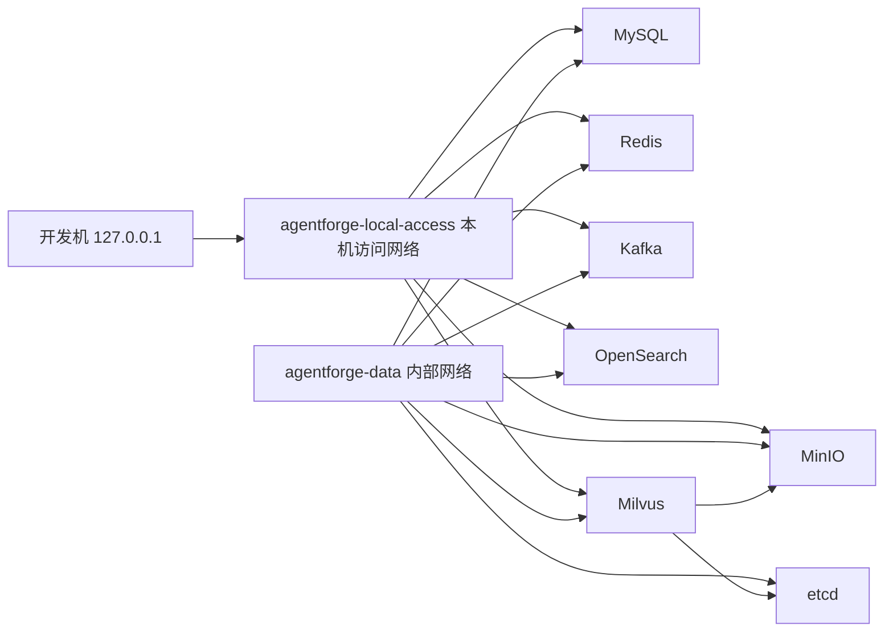

# 第 5 步：最小本地基础设施规格

状态：第 5 步实现完成，等待确认  
版本：0.1.0  
更新日期：2026-07-27

## 1. 目标

本步使用 Docker Compose 建立可重复的 Local/Test 数据基础设施，为后续金融客服 Harness 和业务模块提供 MySQL、Redis、Kafka、MinIO、OpenSearch 与 Milvus，不让开发者依赖个人电脑上不可追踪的手工安装。

本步完成后应满足：

- 所有容器镜像使用明确版本，不使用 `latest`。
- 一条统一命令可以完成配置校验、启动、健康等待、状态查看和停止。
- 组件之间通过内部数据网络通信；需要宿主机调试的组件同时连接本机访问网络，端口只绑定 `127.0.0.1`。
- MySQL、Redis、Kafka、MinIO、OpenSearch、Milvus 和 Milvus 元数据分别使用持久卷。
- `down` 默认保留持久卷，重启后基础数据仍然存在。
- Local/Test 使用不同项目名、端口与凭证占位符，避免误连和状态串用。
- 配置文件和测试不包含生产密钥或真实金融数据。

## 2. 非目标

本步不做以下工作：

- 不创建金融业务表、索引 Mapping、Milvus Collection、Kafka 业务 Topic 或 MinIO 正式 Bucket 策略。
- 不实现 Channel、RAG、LLM Gateway、Agent Runtime、Agent/Skill Registry、Memory、MCP 或 Sandbox 业务。
- 不实现第 6 步 Fake LLM、Mock MCP、固定金融数据和场景回放。
- 不部署 Keycloak、完整可观测平台、OCR、模型服务、Nginx/Caddy 或业务容器。
- 不对公网发布端口，不配置生产域名与 TLS，不引入 Kubernetes。
- 本地健康通过不代表生产高可用、备份恢复、容量或正式上线门禁已经完成。

## 3. 组件职责与版本

| 组件 | 镜像版本 | 本地职责 | 持久化 |
|---|---|---|---|
| MySQL | `mysql:8.4.7` | 关系元数据和后续事务数据底座 | `mysql-data` |
| Redis | `redis:8.2.3-alpine` | 短期状态、幂等、配额和缓存底座 | `redis-data` |
| Kafka | `apache/kafka:4.1.1` | 消息、文档、Agent 和审计事件底座 | `kafka-data` |
| MinIO | `minio/minio:RELEASE.2025-09-07T16-13-09Z` | 原文件与处理结果对象存储底座 | `minio-data` |
| MinIO Client | `minio/mc:RELEASE.2025-08-13T08-35-41Z` | 幂等初始化本地 Bucket | 无 |
| OpenSearch | `opensearchproject/opensearch:3.3.2` | BM25 全文检索底座 | `opensearch-data` |
| etcd | `quay.io/coreos/etcd:v3.5.18` | Milvus 内部元数据依赖 | `etcd-data` |
| Milvus | `milvusdb/milvus:v2.6.6` | 文本、表格和图片向量检索底座 | `milvus-data` |

镜像版本更新必须单独审查兼容性并重新执行配置、健康和持久化验证，不能直接改为浮动标签。

## 4. 环境与配置输入

Compose 只接受显式环境文件：

```text
infra/environments/local.env.example
infra/environments/test.env.example
```

两个文件只包含可提交的本地占位值。真实生产密钥不进入本仓库；生产环境配置在第 20 步使用独立密钥管理。

Local 默认端口：

| 组件 | 宿主机端口 | 容器端口 |
|---|---:|---:|
| MySQL | 3307 | 3306 |
| Redis | 6379 | 6379 |
| Kafka | 9092 | 9092 |
| MinIO API | 29000 | 9000 |
| MinIO Console | 29001 | 9001 |
| OpenSearch | 9200 | 9200 |
| Milvus | 19530 | 19530 |
| Milvus Health | 19091 | 9091 |

Test 使用独立端口段，避免与 Local 同时运行时冲突。etcd 不映射到宿主机。

Local 的 MySQL 宿主机端口使用 `3307`，用于避让开发机上常见的既有 MySQL 5.7/8.0 `3306` 监听；容器内部和服务间连接仍使用标准端口 `3306`。

Local 的 MinIO 宿主机端口使用 `29000/29001`，用于避让开发机既有的
Milvus MinIO `9000/9001` 监听；容器内部和服务间连接仍使用标准端口
`9000/9001`。

## 5. 网络与访问边界



安全不变量：

- 所有发布端口必须采用 `127.0.0.1:host:container`，不能监听 `0.0.0.0`。
- Smoke 必须从宿主机验证全部 8 个 Local/Test 发布端口真实可达，不能只检查 Compose 声明或容器内部健康。
- 数据组件之间只能使用 `agentforge-data` 内部网络地址通信；不得通过宿主机端口互相调用。
- etcd 与 `minio-init` 只连接 `agentforge-data`，不连接本机访问网络，也不发布宿主机端口。
- 需要宿主机调试的组件额外连接 `agentforge-local-access`。该网络只用于 Local/Test 端口转发，不能复制为生产或安全沙箱网络策略。
- Redis、MySQL 和 MinIO 使用环境文件中的独立本地凭证。
- Kafka 和禁用安全插件的 OpenSearch 只允许本机访问；生产不能沿用该配置。
- 容器不挂载 Docker Socket，不使用宿主机目录保存正式数据。
- 组件不依赖任意外部业务服务；当前 Local/Test 访问网络不是生产隔离边界。

## 6. 启动、健康与停止状态

```text
absent
→ creating
→ starting
→ healthy
→ stopping
→ stopped
```

任何必需服务进入 `unhealthy`、`exited` 或超过等待时限，统一命令返回失败并打印 Compose 状态和最近日志。

`minio-init` 是一次性初始化任务，状态为成功退出，不作为常驻服务。Milvus 只有在 MinIO 初始化和 etcd 健康后才启动。

健康检查：

- MySQL：`mysqladmin ping`
- Redis：带本地密码执行 `PING`
- Kafka：查询 Broker API Versions
- MinIO：调用 `/minio/health/live`
- OpenSearch：集群至少达到 `yellow`
- etcd：`etcdctl endpoint health`
- Milvus：调用 `/healthz`

## 7. 数据与重启语义

- `up` 和 `restart` 不删除持久卷。
- `down` 只停止和删除容器、网络，默认保留卷。
- 清空卷属于破坏性操作，必须显式输入确认，不能被普通检查或 CI 自动执行。
- 持久化验证只写入合成探针数据，验证后清理；不得写入真实金融或个人数据。
- Redis 开启 AOF，Kafka 数据、MySQL 数据、MinIO 对象、OpenSearch 索引、Milvus 数据和 etcd 元数据分别保存在命名卷中。

## 8. 错误语义

| 错误 | 统一命令行为 |
|---|---|
| Docker CLI/Compose 缺失 | 立即失败并说明缺失工具 |
| Docker daemon 未运行 | 立即失败并提示启动 Docker Desktop/Engine |
| 环境变量缺失 | `docker compose config` 失败，不创建容器 |
| 端口冲突 | 启动失败，输出冲突服务和端口 |
| 镜像拉取失败 | 保留错误，不改为浮动版本或其他未审查镜像 |
| 服务健康超时 | 返回失败，输出 `ps` 和最近日志 |
| 持久化探针丢失 | 验收失败，不把容器重启解释为数据可靠 |

## 9. Agent、Skill 与 Sandbox 关系

- 当前基础组件不能被 Agent 或 Skill 直接调用，因为 Agent Runtime、Skill Registry 和权限层尚未实现。
- 后续服务必须通过自身 Repository、Gateway 和租户校验访问数据组件，不能把本地端口暴露给终端用户。
- 当前 Compose 网络不是安全沙箱；第 15 步沙箱仍必须独立实现 non-root、只读根文件系统、默认禁网、资源/PID/超时限制和销毁。
- 当前组件健康不能替代 Agent/Skill Harness、跨租户测试或生产发布门禁。

## 10. 可度量指标

| 指标 | 第 5 步目标 |
|---|---|
| 镜像浮动标签数量 | 0 |
| 对 `0.0.0.0` 发布的数据端口数量 | 0 |
| 健康检查覆盖率 | 7/7 常驻组件 |
| Local/Test 项目名和宿主机端口冲突数量 | 0 |
| 普通 `down` 导致的卷删除数量 | 0 |
| 持久化重启探针丢失数量 | 0 |
| 生产密钥或真实金融数据数量 | 0 |

## 11. 统一命令

```text
python tools/infra.py config --env local
python tools/infra.py up --env local
python tools/infra.py wait --env local
python tools/infra.py status --env local
python tools/infra.py smoke --env local
python tools/infra.py restart-verify --env local
python tools/infra.py down --env local
```

`config` 可在 daemon 未运行时检查插值后的 Compose 模型；其他命令需要 Docker daemon。

## 12. 验收场景

可执行规格见：

```text
specs/engineering/local-infrastructure.feature
```

本步完成时至少执行：

```text
python tools/check.py ci
python tools/infra.py config --env local
python tools/infra.py config --env test
python tools/infra.py up --env local
python tools/infra.py wait --env local
python tools/infra.py smoke --env local
python tools/infra.py restart-verify --env local
python tools/infra.py down --env local
git diff --check
```
