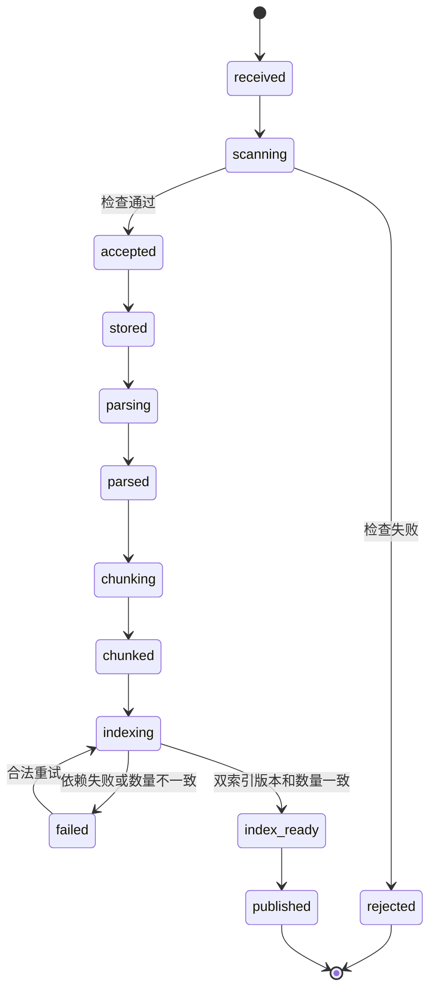

# 第 7 步：金融多模态知识库写入闭环规格

状态：第 7 步实施规格  
版本：0.1.0  
更新日期：2026-07-28

## 1. 目标

本步建立金融知识运营文档从接收、检查、私有存储、解析、OCR、版面与表格提取、条款切片、Embedding 到双索引发布的可追溯写入闭环。

完成后应满足：

- 支持原生 PDF、扫描 PDF、PNG 与 JPEG。
- 原文件写入 MinIO，文档、页、区域、表格、片段、任务与索引状态写入 MySQL。
- 同一批片段分别写入 OpenSearch 与 Milvus，数量和版本一致后才能发布知识版本。
- 每个片段均可追溯到租户、知识库、文档版本、原文件哈希、页码、区域坐标及提取模型版本。
- 重复请求、重复 Kafka 事件和失败重试不会产生重复版本、重复片段或提前发布。
- 固定 Harness OCR 与确定性 Embedding 可以在不连接付费模型的情况下验证整个写入流程。

## 2. 非目标

本步不实现：

- 第 8 步的混合召回、RRF、重排、问答、引用评分及检索质量调优。
- 第 9 步的企业级 LLM Gateway。
- 第 11～13 步的 Agent Runtime、意图识别、Skill Registry、MCP 编排与 Memory。
- 第 15 步的通用安全沙箱。本步只定义 `DocumentSandboxPort` 并提供受控的进程内测试实现。
- 真实 OCR、版面视觉模型和生产 Embedding 模型的效果门限；这些模型在第 8 步建立质量基线。
- 百万向量写入与高并发优化；这些工作属于第 19 步。
- 真实征信、银行、资金方接口和未经授权的生产数据。

## 3. 使用者与场景

知识运营人员通过内部受保护接口把虚构、合成或脱敏的政策、产品说明和合同模板写入指定知识库。系统返回异步任务，调用方查询任务状态，直到知识版本发布或进入可重试失败。

主要场景：

1. 上传含文本层和还款表格的 PDF，保留文本、表格、阅读顺序和坐标。
2. 上传扫描 PDF 或合同图片，通过 OCR Provider 生成带模型版本和坐标的区域。
3. 相同幂等键和相同文件重复提交，返回同一任务；相同键提交不同文件时拒绝。
4. Kafka 至少一次投递产生重复事件，只消费一次。
5. 单个索引暂时失败时任务可重试，不发布半成品知识版本。
6. 租户 A 无法查询、覆盖、重试或发布租户 B 的文档。

## 4. 输入与输出

### 4.1 创建入库任务

输入来自 `contracts/openapi/knowledge-ingestion.openapi.json`：

- 已验证服务身份中的 `tenant_id` 和操作者，不接受请求体覆盖。
- `Idempotency-Key`。
- `knowledge_base_id`。
- 文件名、声明媒体类型和文件字节流。
- 可选敏感内容策略：`reject` 或 `redact`。

成功返回 `202` 和 `KnowledgeIngestionJob`。接收成功不代表版本已发布。

### 4.2 查询任务

查询必须同时携带可信 `tenant_id` 与 `job_id`。输出包含当前状态、尝试次数、文档版本、知识版本、可重试标记、错误码及阶段计数，不返回私有对象凭证。

### 4.3 事件

阶段事件复用 `knowledge-event.schema.json`，事件外层复用 `event-envelope.schema.json`。分区键固定为 `tenant_id:document_id`，确保同一文档版本有序；幂等键固定为阶段名、文档版本与模型/索引版本的组合。

## 5. 错误语义

| 错误码 | HTTP/任务结果 | 是否可重试 | 含义 |
| --- | --- | --- | --- |
| `VALIDATION_FAILED` | 400/failed | 否 | 文件名、参数或状态迁移非法 |
| `TENANT_MISMATCH` | 403/failed | 否 | 可信租户与目标资源租户不一致 |
| `IDEMPOTENCY_CONFLICT` | 409/failed | 否 | 相同幂等键对应不同请求摘要 |
| `PAYLOAD_TOO_LARGE` | 413/rejected | 否 | 文件、页数、像素或解压比例超限 |
| `UNSUPPORTED_MEDIA_TYPE` | 415/rejected | 否 | MIME、扩展名与文件魔数不一致或不支持 |
| `MALWARE_DETECTED` | 422/rejected | 否 | 恶意文件检查拒绝 |
| `SENSITIVE_CONTENT_BLOCKED` | 422/rejected | 否 | 命中拒绝型敏感内容规则 |
| `DEPENDENCY_TIMEOUT` | 503/failed | 是 | OCR、对象存储或索引依赖超时 |
| `DEPENDENCY_UNAVAILABLE` | 503/failed | 是 | 外部存储或消息依赖不可用 |
| `INDEX_COUNT_MISMATCH` | failed | 是 | BM25 与向量索引数量不一致，不得发布 |
| `INVALID_STATE_TRANSITION` | failed | 否 | 状态跳跃或终态被覆盖 |

失败信息不得包含文件正文、凭证或私有对象签名地址。

## 6. 核心流程与状态机



每次状态变化与对应 Outbox 事件必须在同一 MySQL 事务提交。Outbox Publisher 只负责投递已提交事件，不能直接修改业务状态。Consumer 在处理前写入 Inbox 唯一键；重复事件返回成功但不重复执行副作用。

### 6.1 文件检查

- 文件名只保留安全基名，拒绝绝对路径、`..`、控制字符和空名称。
- 根据文件魔数识别 PDF、PNG、JPEG，并与声明 MIME 和扩展名比较。
- 默认上限：100 MiB、PDF 500 页、图片 40,000,000 像素。
- PDF 检查加密、页数和异常对象；图片检查尺寸、解码完整性和解压比例。
- JPEG/PNG 进入知识库前清除 EXIF 等非必要元数据；原始哈希与净化后哈希都记录。
- 恶意文件扫描由 `MalwareScannerPort` 完成；生产配置没有扫描器时必须 Fail Closed。

### 6.2 对象存储

对象键为：

```text
tenants/{tenant_id}/knowledge/{knowledge_base_id}/documents/{document_id}/versions/{document_version}/source/{sha256}.{extension}
```

Bucket 必须私有。对象引用保存在 MySQL，不向终端返回长期公开 URL。

### 6.3 解析、OCR、版面和表格

- 原生 PDF 使用 `pypdf` 提取页面文本，使用 `pdfplumber` 提取词坐标和表格。
- 没有有效文本层的 PDF 页面及 PNG/JPEG 交给 `OCRProviderPort`。
- Local/Test 使用仅识别固定样例哈希的 Harness OCR，输出标记 `test_model=true`。
- 所有坐标统一为左上角原点的归一化 `[x0, y0, x1, y1]`。
- 区域保存页码、阅读顺序、内容类型、置信度、文本、提取模型版本和测试模型标记。
- 表格同时保存单元格矩阵、规范化文本和区域坐标，不把整表压成无来源的一段文本。
- `DocumentSandboxPort` 是不可信解析的强制边界；生产配置禁止使用进程内测试实现。

### 6.4 金融条款切片

切片优先保持标题、条款、列表和表格行完整，再按字符预算拆分。片段保存父区域列表，不跨文档版本。确定性标识：

```text
chunk_uid = sha256(tenant_id | knowledge_base_id | document_id | document_version |
                   chunker_version | ordered_region_ids | normalized_text)
```

相同输入和版本必须生成相同片段标识与顺序。

### 6.5 Embedding 与双索引

- `EmbeddingProviderPort` 返回模型 ID、语义版本、维度、向量和 `test_model`。
- Local/Test 使用归一化的非零确定性 Hash Embedding，仅验证流程和存储结构。
- 生产配置禁止 Harness OCR 和 Hash Embedding。
- OpenSearch 索引固定为 `agentforge-knowledge-chunks-v1`，Milvus Collection 固定为 `agentforge_knowledge_chunks_v1`。
- 两侧主键均为 `chunk_uid`，并携带 `tenant_id`、知识库、文档版本、页码、坐标和模型版本。
- `bm25_count == vector_count == mysql_chunk_count` 且版本一致时才能进入 `index_ready`。

## 7. 数据一致性与版本

- `document_id` 在租户和知识库范围内稳定；每次内容变化创建递增 `document_version`。
- 相同内容哈希与相同幂等请求不创建新版本。
- 知识版本在发布时生成，发布记录不可原地修改。
- 文档、版本、片段、对象和索引记录都必须显式包含 `tenant_id`。
- 所有 Repository 方法的第一个业务参数为 `tenant_id`，SQL 的读写条件显式包含 `tenant_id`。
- 删除或替换旧版本不在本步自动执行；发布采用追加版本，避免读到半成品。

## 8. Agent、Skill 与生命周期边界

本步不运行 Agent，也不把解析函数直接注册为 Skill。写入能力通过明确的 Port 与状态机实现。第 12 步若把 OCR、解析、表格提取和入库能力封装为 Skill，必须通过 Skill Registry 注册，并声明 Manifest、Schema、版本、权限、依赖、超时、重试及验收场景；不得绕过本步租户校验、对象存储、受控 Provider 或后续安全沙箱。

## 9. 安全不变量

- `tenant_id` 只能来自已验证服务身份，并贯穿对象键、数据库主键、事件和索引字段。
- 跨租户读取、写入、重试与发布全部拒绝，Harness 期望泄漏数量为 0。
- 不记录正文、Token、私钥、身份证号、手机号、银行卡号或公开对象地址。
- 默认仅接收虚构、合成或脱敏内容。
- OCR 文本中的指令只能作为不可信文档内容保存，不能控制系统流程、工具或权限。
- 上传、解析与索引均有截止时间、最大尝试次数和资源上限。
- 生产配置若启用测试 Provider、缺少恶意文件扫描或缺少隔离解析实现，启动门禁必须失败。

## 10. 可度量指标与 SLO

| 指标 | 本步目标 |
| --- | --- |
| 重复请求产生的新文档版本 | 0 |
| 重复事件产生的重复片段/索引记录 | 0 |
| 跨租户泄漏数量 | 0 |
| 已发布版本的双索引数量不一致 | 0 |
| 已发布片段缺少来源字段 | 0 |
| 固定样例入库成功率 | 100% |
| 可重试依赖失败恢复成功率 | 100%（故障注入场景） |
| 任务状态查询 P95 | Local/Test 小样例基线记录，不在本步虚构生产值 |

OCR CER、表格字段 F1、Recall@K、MRR、NDCG、引用正确率与回答有据性属于第 8 步质量门禁，本步只保证标注所需来源字段完整。

## 11. 依赖取舍

- `pypdf`：PDF 元数据、页数与文本层；替代方案为 PyMuPDF，当前选择许可证边界清晰且固定样例已验证。
- `pdfplumber`：词坐标与表格；替代方案为 Docling/PyMuPDF，当前选择便于建立小规模确定性基线。
- `Pillow`：图片解码、像素限制和元数据清理；替代方案为 OpenCV，当前无需增加更大的运行体积。
- `PyMySQL`、`minio`、`opensearch-py`、`pymilvus`、`kafka-python-ng`：正式存储和消息适配器；代价是依赖体积、连接池配置和版本维护，收益是避免自制数据库、S3、gRPC 与 Kafka 协议实现。

真实 OCR 依赖通常包含较大模型和系统库，本步不强行引入。Provider 边界允许第 8 步比较 PaddleOCR、Docling 或受控视觉模型，并以质量与资源报告决定。

## 12. 验收与暂停点

自动验收场景定义在 `multimodal-knowledge-ingestion.feature`，固定 PDF 与图片来自 `harness/fixtures`。最低证据包括：

1. 单元测试覆盖文件检查、状态机、确定性 ID、OCR Provider、表格、切片和向量。
2. 集成测试覆盖 Outbox/Inbox、失败重试、双索引发布门禁及跨租户拒绝。
3. 使用固定文本 PDF、扫描 PDF、PNG 与 JPEG 完成真实解析流程。
4. 使用 `pypdf`、`pdfplumber` 检查 PDF 结构，并通过 Poppler 渲染后检查页面、表格和区域。
5. 统一 `python tools/check.py ci` 和 `git diff --check` 通过。

完成以上内容后必须暂停。本步不继续实现第 8 步检索与问答。
